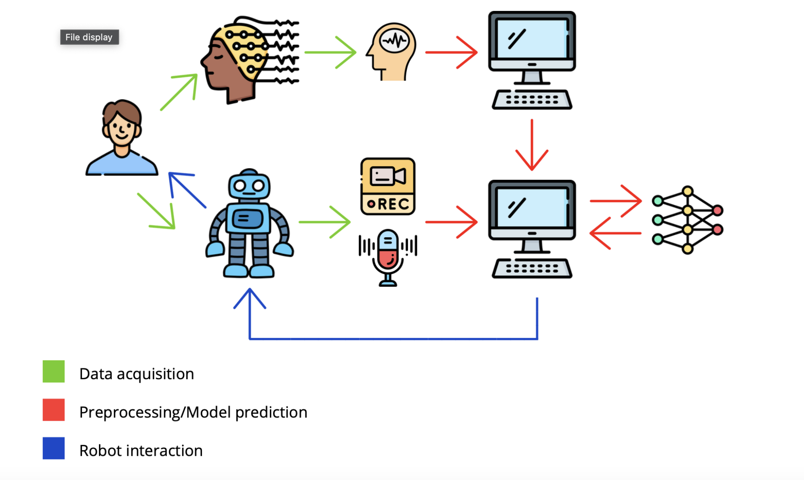

# Emotion-Aware Human-Robot Interaction

## Overview
This project aims to create an **emotion-aware human-robot interaction system** using **Pepper**, **Emotiv Epoc X**, and machine learning techniques. The system acquires EEG, audio, and video data to classify the user’s emotional state into four categories (**happy, sad, angry, neutral**). Based on the classification, **Pepper** engages in adaptive interactions to enhance user well-being through entertainment, relaxation, or motivation.

## Model and Code
The emotion classification model is trained using **RAVDESS** (for audio/video) and **SEED-IV** (for EEG) datasets. The implementation and model details are available on GitHub:

🔗 **[GitHub Model Repository](https://github.com/RenatoEsposito1999/Cognitive-Robotics-Project-Multi-Modal-Emotion-Classification)**

For more details on the data flow and process, refer to the documentation in this repository.

Mentioned model requires download of SEED-IV, available by request at following link.

🔗 **[SEED-IV](https://bcmi.sjtu.edu.cn/~seed/seed-iv.html)**

___
## I. System and environment requirements
Metamodel for emotion classification requires following dependencies:
- Python 3.9
- PyTorch 2.6
- Torcheeg 1.1.3

Pepper interaction scripts require:
- Python 2.7
- Ubuntu 14.04 (different versions of Ubuntu/Linux are not supported.)
- **[NAOqi](https://developer.softbankrobotics.com)** available at this link from SoftBankRobotics official website.
- 🤖 Pepper version: 1.8 (follow this **[link](http://doc.aldebaran.com/2-5/family/pepper_technical/pepper_versions.html)** for further details on your Pepper version.
- 🧠 Headset version: Empatica EPOC X (14 channels headset)
___
## II. Run this project
1. Download this repository, SEED-IV dataset and MetaModel repository following links mentioned before and move SEED-IV/eeg_raw_data/ folder in the /EEG_model/dataset/ folder.
```bash
mv SEED-IV/eeg_raw_data/ Cognitive-Robotics-Project-Multi-Modal-Emotion-Classification/EEG_model/dataset/
```
Your folders should appear like this example:
```
📂 parent-directory
│
├───📂 Cognitive-Robotics-Project-Multi-Modal-Emotion-Classification
│   │
│   ├───📂 audio_video_emotion_recognition_model
│   │   ├───📂 datasets       
│   │   ├───📂 Data_preprocessing        
│   │   ├───📂 Image      
│   │   ├───📂 Multimodal_transformer 
│   │   │   ├───📂 Preprocessing_CNN  
│   │   │   │   ├───📂 Preprocessing_utils
│   │   │   │   
│   │   │   ├───📂 Transformers
│   │   │           
│   │   ├───📂 results      
│   │   ├───📂 utils
│   │                 
│   ├───📂 EEG_model  
│   │   ├───📂 datasets   
│   │   ├───📂 Images     
│   │   ├───📂 results       
│   │   ├───📂 utils 
│   │     
│   ├───📂 envs    
│   ├───📂 Meta_model        
│   │   ├───📂 results      
│   └───📂 Shared
│
├───📂 cognitive-robotics
│   ├───📂 scripts
│   ├───📂 images
|   ├───📂 video
|   ├───📂 audio
|   ├───📂 data
|   ├───📂 Questionnaires
│   └───📂 EEG
```
2. Download EmotivAPP for headset data acquisition. Open this app and put your headset on. After electrodes reach >90% accuracy, you can start EEG acquisition. If there is no headset available, you could use csv EEG data in cognitive-robotics/data/ and move it to EEG_model folder.

3. Then, run /scripts/init.py, specifying your model path:
```bash
python init.py /Cognitive-Robotics-Project-Multi-Modal-Emotion-Classification/
```
This run will activate your Pepper interaction session and will record audio/video data of the user.
Simultaneously, data acquisition process via Emotiv Epoc X must be executed by EmotivAPP. Please, don't remove your headset until the demo is not ended and download the output .csv file in the appropriate directory of the EEG_model folder.


To test **only** the meta-model, move to the correspondent folder Cognitive-Robotics-Project-Multi-Modal-Emotion-Classification/Meta_model/ and run:
```bash
python main.py --no_train --no_val --test --predict
```
If eeg_path is already cached in local, please load it by including --eeg_path option.
See opt file for more details.

___


___

## III. **Involved Devices**
- **Pepper**: Humanoid robot for interaction and audio/video data acquisition, equipped with microphones and a camera for facial expression and voice tone analysis.
- **Emotiv Epoc X**: EEG sensor for brain data acquisition, capable of detecting emotional states by reading brain waves.
- **Device 1 (Ubuntu 14.04LTS)**: Main server managing data processing and emotion prediction.
- **Device 2 (any)**: Used to manage EEG acquisition via the Emotiv APP and transfer data to the main server. (optional, Device 2 tasks can be integrated on Device 1 if system requirements are satisfied.)

---

## IV. **Steps**
The following process explanation describes the dataflow and the sequence of actions performed by authors' devices. For single device run, skip the SCP transfer step between Device1 and Device2 in EEG acquisition.

___

### **0. Questionnaires**
Participants anonymously complete the IRI (Interpersonal Reactivity Index) and BIG5 personality questionnaires, which are then analyzed as part of our study. These responses help us explore the relationship between personality traits, empathic tendencies, and the emotional variations observed during interactions with Pepper.
___

### **1. Connection and Startup**
1. **Powering up Pepper** and connecting it to Device 1 via a local network for data transmission.
2. **User preparation:** correctly positioning the Emotiv Epoc X headset on the user's head to ensure accurate EEG readings.
3. **Starting the EEG session** on Device 2, which begins real-time brain data collection.
4. **Initial interaction:** Pepper asks the user how they feel, recording the response through audio and video.
5. **Processing delay:** a short pause is introduced to allow data transmission and emotion prediction.

---

### **2. Data Acquisition Phase**
#### **EEG Data:**
- Collected by the Emotiv Epoc X headset and managed via the Emotiv APP on Device 2.
- Transferred to Device 1 using the SCP protocol for secure and reliable connection.

#### **Audio/Video Data:**
- **Pepper uses its camera** to record the user's facial expressions and microphone to analyze voice tone.
- An audio file and a separate video file are recorded, both approximately 5 seconds long, with the extensions .wav (pepper_audio.wav) and .ova (pepper_video.ova), respectively.
- Data is stored locally on Pepper.
- Through SCP Pepper, Pepper sends the data to Device 1 for processing.
- The separate audio and video files are merged using the ffmpeg command into a single .mp4 file (input.mp4), specifically, the format required by the model for multimedia data.
  
---

### **3. Processing and Final Prediction**
1. **Data preprocessing:** EEG, audio, and video data are converted into formats compatible with training datasets:
   - **RAVDESS** for audio/video data (emotion recognition from voice and facial expressions).
   - **SEED-IV** for EEG data (brainwave analysis for emotion recognition).
2. **Emotion prediction:** preprocessed data is fed into the classification model, which generates an output among the four emotional classes:
   - **Angry**
   - **Sad**
   - **Happy**
   - **Neutral**
3. **Model's predicition:** the model's predictions are saved in a .txt file (predictions.txt). Specifically, a new file is created for each interaction with Pepper, and inside it, the integers corresponding to the predicted emotions are saved (neutral -> 0, happy -> 1, angry -> 2, sad -> 3), if multiple predictions are made during the same interaction with Pepper, the new ones are added on a new line.  
4. **Execution on Device 1:** the entire processing workflow occurs locally to ensure speed and security in handling sensitive data. The device reads the integer corresponding to the last line and selects the corresponding behavior for Pepper to execute.

---

### **4. Human-Machine Interaction**
Based on the classification output, Pepper adopts specific interaction strategies to improve the user's emotional well-being:

- **😔 Sad:**
  - Pepper provides a selection of jokes and light-hearted stories to entertain the user.
  - If sadness persists, it can offer a short motivational story.
- **😠 Angry:**
  - Suggests a guided meditation session (short or long) with breathing exercises.
  - Can play relaxing sounds such as ocean waves or rainfall to promote relaxation.
- **😊 Happy:**
  - Reinforces positive emotions through music and dance.
  - Pepper performs specific movements synchronized with the user's chosen music.
- **😐 Neutral:**
  - The user can choose from three options:
    1. Jokes and entertainment.
    2. Meditation.
    3. Music and dance.
    4. Interactive quiz using a tablet.

---

### **5. Data Visualization & Behavior Tracking (Optional)** 📊
-	Throughout the entire interaction, data acquisition is continuously performed to track real-time emotional variations using Pepper.
-	EEG, audio, and video data are collected and classified at the end of the session for a comprehensive evaluation of emotional states.
-	For deeper analysis and validation, we segment the recorded data into 3-second time slices, analyzing them at regular 10-second intervals. This allows us to monitor emotional fluctuations throughout the session.
-	Each time slice is classified using our model to identify potential variations in the user’s state over time.
-	Finally, we compare the initial predicted emotional class with the classification results obtained post-interaction, assessing the impact of the session with Pepper on the user’s well-being.
- To better understand emotional variations over time, we plot the collected data, allowing us to visually track behavioral trends throughout the session. This helps in identifying patterns and assessing the impact of the interaction with Pepper 📈.
- To complement this analysis, participants also complete the IRI (Interpersonal Reactivity Index) and BIG5 (Five-Factor Model) questionnaires. The responses, collected anonymously, are processed to identify personality traits and empathic tendencies, helping to correlate these factors with emotional fluctuations observed during the session.

---
